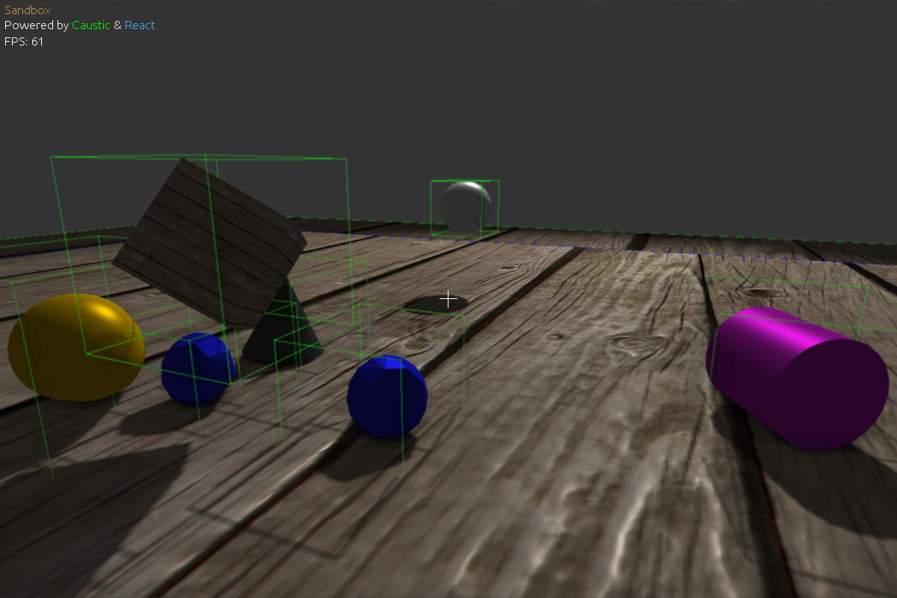

ReactSandbox
=======================

Visual debugging and testing for the React physics library.

Also used to develop Caustic. The render implements:
- Shadow mapping
- Screen space ambient occlusion
- Motion blur
- Normal and specular mapping
- Edge-detection anti-aliasing

